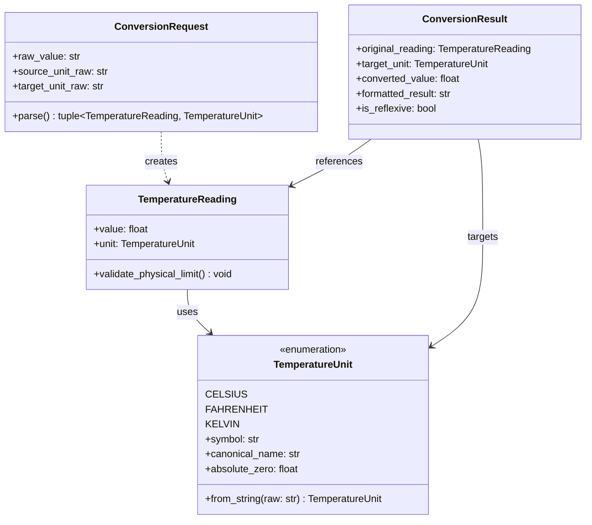

# Data Model: Conversor de Temperatura CLI

**Feature**: Conversor de Temperatura CLI (`001-temperature-converter-cli`)  
**Date**: 2026-09-05  
**Status**: Draft  

---

## Entidades Principales

### 1. TemperatureUnit (Enumeración)
Representa las escalas termodinámicas soportadas por el sistema.

- **Valores**:
  - `CELSIUS`: Escala centígrada (°C).
  - `FAHRENHEIT`: Escala Fahrenheit (°F).
  - `KELVIN`: Escala Kelvin absoluta (K).
- **Atributos de Unidad**:
  - `symbol`: Símbolo representativo (`°C`, `°F`, `K`).
  - `canonical_name`: Nombre canónico (`Celsius`, `Fahrenheit`, `Kelvin`).
  - `absolute_zero`: Límite inferior físico (-273.15 para Celsius, -459.67 para Fahrenheit, 0.0 para Kelvin).
  - `aliases`: Conjunto de alias aceptados (`["c", "celsius", "°c"]`, `["f", "fahrenheit", "°f"]`, `["k", "kelvin"]`).

### 2. TemperatureReading (Entidad de Medida)
Representa una lectura térmica puntual.

- **Campos**:
  - `value`: `float` - Magnitud cuantitativa de la temperatura.
  - `unit`: `TemperatureUnit` - Escala en la que se expresa la magnitud.
- **Reglas de Validación**:
  - `value` debe ser un número real finito (`math.isfinite(value) == True`).
  - `value >= unit.absolute_zero`: Debe respetar el cero absoluto de su respectiva unidad.
    - Si `unit == TemperatureUnit.KELVIN` y `value < 0.0`: Error ("Kelvin no puede ser menor a 0").
    - Si `unit == TemperatureUnit.CELSIUS` y `value < -273.15`: Error ("Temperatura no puede ser inferior al cero absoluto (-273.15 °C)").
    - Si `unit == TemperatureUnit.FAHRENHEIT` y `value < -459.67`: Error ("Temperatura no puede ser inferior al cero absoluto (-459.67 °F)").

### 3. ConversionRequest (Objeto de Transferencia de Entrada)
Encapsula la intención de conversión del usuario.

- **Campos**:
  - `raw_value`: `str` - Cadena de texto recibida para el valor numérico.
  - `source_unit_raw`: `str` - Cadena de texto para la unidad de origen.
  - `target_unit_raw`: `str` - Cadena de texto para la unidad de destino.
- **Reglas de Validación**:
  - `raw_value` no debe ser nulo, vacío ni contener solo espacios en blanco.
  - `raw_value` debe ser convertible a `float`.
  - `source_unit_raw` y `target_unit_raw` deben coincidir con un alias válido de `TemperatureUnit`.

### 4. ConversionResult (Entidad de Resultado)
Representa el resultado final procesado y listo para presentación.

- **Campos**:
  - `original_reading`: `TemperatureReading` - Lectura de entrada validada.
  - `target_unit`: `TemperatureUnit` - Unidad a la que se convirtió.
  - `converted_value`: `float` - Valor numérico calculado y redondeado a 2 decimales (`round(val, 2)`).
  - `formatted_result`: `str` - Cadena de salida formateada (ej. `"32.00 °F"`, `"25.50 °C"`).
  - `is_reflexive`: `bool` - `True` si la unidad origen y destino son la misma.

---

## Diagrama de Relaciones de Entidades

